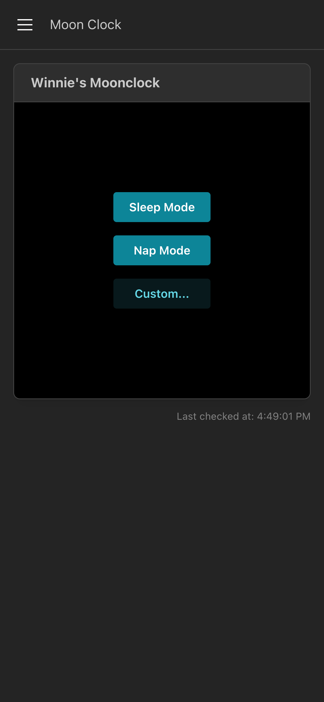
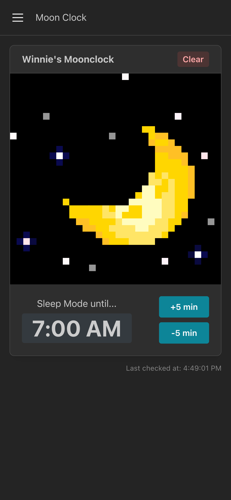
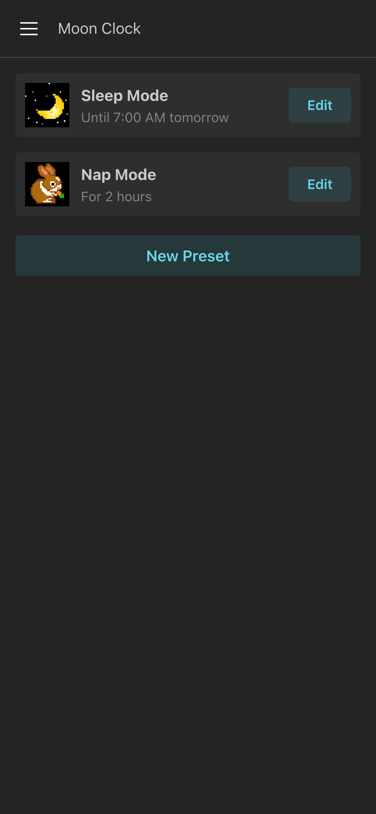
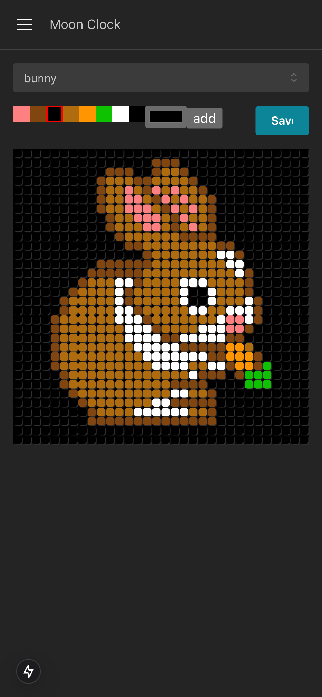
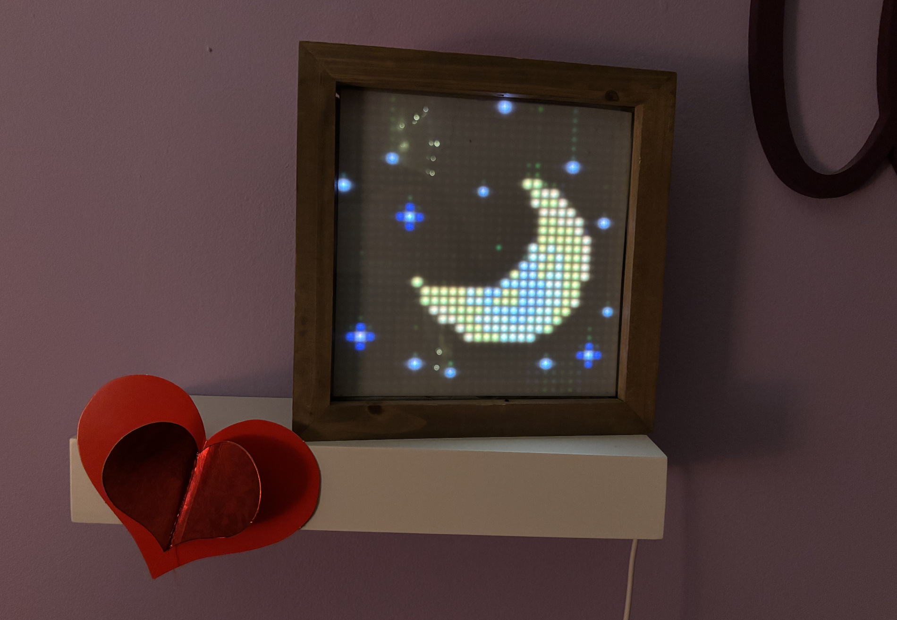
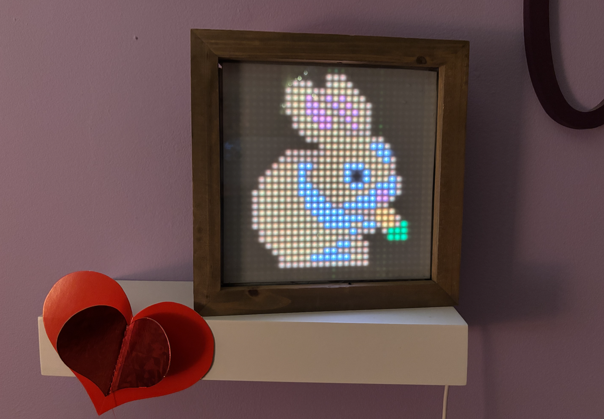

# Moonclock

## What is this?

It's a LED display powered by a RaspberryPi and you control it via this webapp, hosted on the Pi.

You can configure an LED scene to display..

- For a period a time
- Until a specific time, tomorrow

I created this to help teach my toddler when bedtime and naptime are over, however the use-cases extend much farther!

```
"Daddy, my moonclock is off!"
My daughter, every morning at 7am! 😮‍💨
```

## The webapp and Panel

<p float="left">
    
    
    
    
</p>

👉 Unfortunately **a photo doesn't capture the colors** well in the panel, but here is a real moonclock in action!

<p float="left">
    
    
</p>

## Technology

The webapp is a Nextjs app that uses React Server Components and Server Actions. It runs off of a local json file that serves as the database.

The panel communication happens via the incredible [hzeller/rpi-rgb-led-matrix](https://github.com/hzeller/rpi-rgb-led-matrix) library and uses [alexeden/rpi-led-matrix](https://github.com/alexeden/rpi-led-matrix) which provides typescript bindings to hzeller's project.

The panel rendering is powered by [node-canvas](node-canvas). This allows for text, shapes, and more to easily be rendered on the panel. Additionally panel scenes can be rendered on the server or in the browser.

There are two processes that are run together:

- Nextjs webapp
- A hardware client

## Building a Moonclock

You'll need the following supplies:

1. A 32x32 LED panel, like this [one](https://www.adafruit.com/product/607)
1. A raspberry PI 3 or 4
1. [Female jumper wires](https://www.adafruit.com/product/266)
1. A usb cable that you can cut to power the LED panel
1. A usb cable to power the raspberry pi
1. Optional - [Translucent plastic](https://www.amazon.com/dp/B09XR1XBWG?ref=ppx_yo2ov_dt_b_fed_asin_title&th=1) to soften the LED Panel
1. Optional - 8.5" x 8.5" frame to house the Panel

Wire the panel according to the wiring chart [here](https://github.com/hzeller/rpi-rgb-led-matrix/blob/master/wiring.md).

👉 Remember, you are wiring a 32x32 panel, double check your work!

## Installation & Setup

Install the latest raspbian (no desktop verions!) on your pi and join it to your network. Then ssh into the machine and let's get going...

First, you'll need to [disable onboard sound](https://github.com/hzeller/rpi-rgb-led-matrix?tab=readme-ov-file#bad-interaction-with-sound). This is a requirement from `hzeller/rpi-rgb-led-matrix`

Update the system and install git...

```
sudo apt update
sudo apt install git
```

Install [nvm](https://github.com/nvm-sh/nvm) and Node 22.9.0...

```
nvm install 22.9.0
nvm use 22.9.0
```

_The software that writes to the panel needs to be run with root access and the moonclock app also needs root access because it is served on port 80. We need to do a little bit of magic to make nvm play nice with `sudo`..._

```
sudo ln -s "$NVM_DIR/versions/node/$(nvm version)/bin/node" "/usr/local/bin/node"
sudo ln -s "$NVM_DIR/versions/node/$(nvm version)/bin/npm" "/usr/local/bin/npm"
```

Install Canvas dependencies...

```
sudo apt-get install build-essential libcairo2-dev libpango1.0-dev libjpeg-dev libgif-dev librsvg2-dev
```

Clone and build Moonclock...

```
cd /usr/local/bin/
sudo git clone https://github.com/roykolak/moonclock.git
cd moonclock
sudo npm install
sudo npm run app:build
```

Finally, install Moonclock as a service...

```
./scripts/install.sh
./scripts/start.sh
```

Your raspberry pi should now be running and serving your moonclock!

Your moonclock will automatically start after any pi restarts.

## Debugging

You can view logs with the following commands:

```
./scripts/log.sh
```
