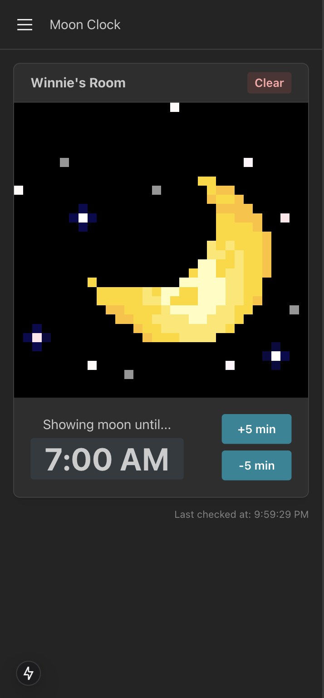

# Moonclock

## What is a Moonclock?

It's a LED display powered by a RaspberryPi and you control it via this webapp, hosted on the Pi.

You can configure an LED scene to display..

- For a period a time
- Until a specific time, tomorrow

I created it this to help with bedtime, naptime, and more for my toddler to teach them when activities are over.

## Getting Started

1. Clone the repo to `/usr/local/bin`
1. `cd /usr/local/bin/moonclock`
1. `sudo cp moonclock.service /etc/systemd/system/`
1. `sudo systemctl daemon-reload`
1. `sudo systemctl enable moonclock`
1. `sudo systemctl start moonclock`
1. `sudo journalctl -fu moonclock`

Open [http://localhost:3000](http://localhost:3000) with your browser to see the result.
