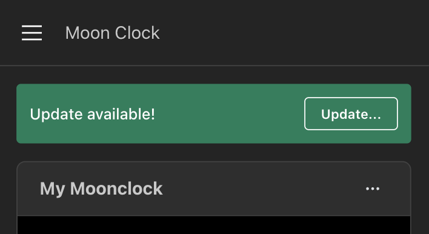

# Moonclock

## What is this?

It's a LED display powered by a RaspberryPi and you control it via this webapp, hosted on the Pi.

You can configure an LED scene to display..

- For a period a time
- Until a specific time, tomorrow

I created this to help teach my toddler when bedtime and naptime are over, however the use-cases extend much farther!

```
"Daddy, my moonclock is off!"
My daughter, every morning at 7am! 😮‍💨
```

## The webapp and Panel

<p float="left">
    
    
    
    
</p>

👉 Unfortunately **a photo doesn't capture the colors** well in the panel, but here is a real moonclock in action!

<p float="left">
    
    
</p>

## Technology

The webapp is a Nextjs app that uses React Server Components and Server Actions. It runs off of a local json file that serves as the database.

The panel communication happens via the incredible [hzeller/rpi-rgb-led-matrix](https://github.com/hzeller/rpi-rgb-led-matrix) library and uses [alexeden/rpi-led-matrix](https://github.com/alexeden/rpi-led-matrix) which provides typescript bindings to hzeller's project.

The panel rendering is powered by [node-canvas](node-canvas). This allows for text, shapes, and more to easily be rendered on the panel. Additionally panel scenes can be rendered on the server or in the browser.

There are three processes that are run together:

- Nextjs webapp
- Hardware client
- Update checker

## Building a Moonclock

You'll need the following supplies:

1. A 32x32 LED panel, like this [one](https://www.adafruit.com/product/607)
1. A raspberry PI 3 or 4
1. [Female jumper wires](https://www.adafruit.com/product/266)
1. A usb cable that you can cut to power the LED panel
1. A usb cable to power the raspberry pi
1. Optional - [Translucent plastic](https://www.amazon.com/dp/B09XR1XBWG?ref=ppx_yo2ov_dt_b_fed_asin_title&th=1) to soften the LED Panel
1. Optional - 8.5" x 8.5" frame to house the Panel

Wire the panel according to the wiring chart [here](https://github.com/hzeller/rpi-rgb-led-matrix/blob/master/wiring.md).

👉 Remember, you are wiring a 32x32 panel, double check your work!

## Installation & Setup

Install the latest raspbian (not desktop verion!) on your pi and join it to your network. Then ssh into the machine and let's get going...

First, you'll need to [disable onboard sound](https://github.com/hzeller/rpi-rgb-led-matrix?tab=readme-ov-file#bad-interaction-with-sound). This is a requirement from `hzeller/rpi-rgb-led-matrix`

Download and untar Moonclock

```
sudo wget -O release.tar.gz https://github.com/roykolak/moonclock/releases/.../release.tar.gz
sudo tar -xzvf release.tar.gz
```

Install Moonclock...

```
cd moonclock
./install.sh
```

Your moonclock will automatically start after any pi restarts.

To start Moonclock immediate run...

```
sudo mc start
```

## Updating

Your moonclock will check if there is a new version available nightly.

When a new version is available, you will see a banner like the one below in your moonclock app. Just click the update buttons and you'll be all set in a few seconds!



## Data Storage

All data is stored in `/var/lib/moonclock`. This includes...

- `database.json`
- `custom_scenes/`

This means that updating moonclock to the latest release will not effect the current of moonclock's data and configuration.

## Debugging

You can view logs with the following commands:

```
mc logs
```

Also you can trigger a restart of the hardware process with:

```
mc restart
```

## Developing locally

Clone and install Moonclock...

```
cd /usr/local/bin/
sudo git clone https://github.com/roykolak/moonclock.git
cd moonclock
sudo npm install
```

```
sudo npm run start:dev
```

## Build a release

```
npm run build
```

## Developing on a vm

This is useful to test updates to the service files, install scripts, and the update process.

Would recommend using [multipass](https://canonical.com/multipass) as it is the quickiest way to start up a vm via the commandline.

```
npm run build
multipass start moonclock-vm
multipass transfer  release.tar.gz moonclock-vm:
multipass shell moonclock-vm
tar -xzvf release.tar.gz
cd ./moonclock
mv dist/hardware/vm-canvas.node dist/hardware/canvas.node
sudo mc start
```
