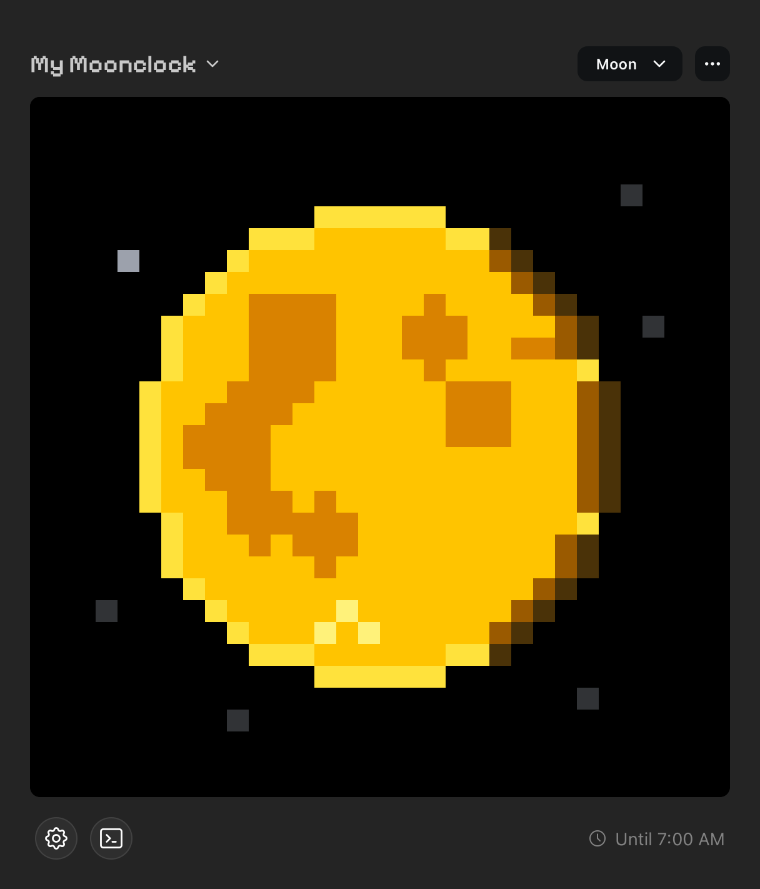
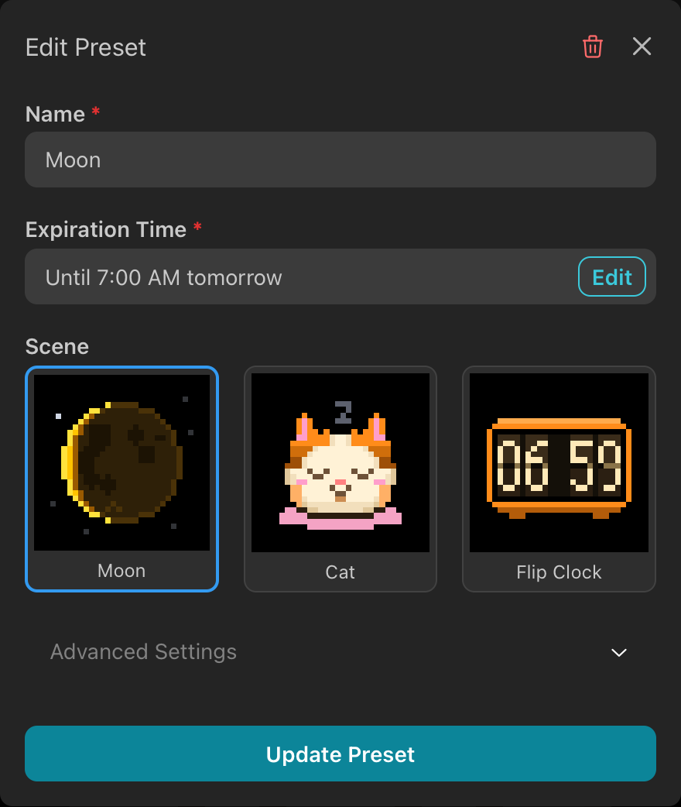
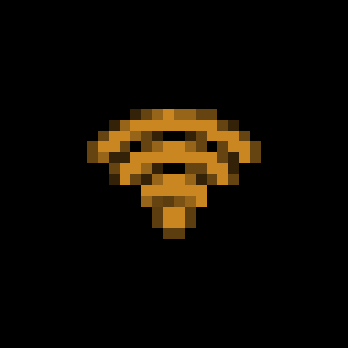

# Moonclock

## What is this?

It's a LED display powered by a RaspberryPi and you control it via this webapp, hosted on the Pi, or via an external button connected via GPIO pins.

You can configure an LED scene to display..

- For a period a time
- Until a specific time, tomorrow

I created this to help teach my toddler when bedtime and naptime are over, however the use-cases extend much farther!

```
"Daddy, my moonclock is off!"
My daughter, every morning at 7am! 😮‍💨
```

## Panel Scenes

The animated scenes, rendered straight from the scene code.

- Moon tracks the real lunar phase for the current date
- Cat that breathes and dozes

<p float="left">
    
    
</p>

## The Webapp

The virtual panel mirrors the hardware pixel for pixel over SSE, so the app always shows exactly what's on the wall. A preset pairs a scene with an expiration — the moon below runs until 7:00 AM tomorrow:

<p float="left">
    
    
</p>

## Technology

The webapp is a Nextjs app that uses React Server Components and Server Actions. It runs off of a local json file that serves as the database.

The panel communication happens via the incredible [hzeller/rpi-rgb-led-matrix](https://github.com/hzeller/rpi-rgb-led-matrix) library and uses [alexeden/rpi-led-matrix](https://github.com/alexeden/rpi-led-matrix) which provides typescript bindings to hzeller's project.

The panel rendering is powered by [node-canvas](node-canvas). This allows for text, shapes, and more to easily be rendered on the panel. Additionally panel scenes can be rendered on the server or in the browser.

There are three processes (via systemd) that are run together:

- Nextjs webapp
- Hardware client
- Update checker

## Building a Moonclock

You'll need the following supplies:

1. [32x32 LED panel](https://www.adafruit.com/product/607)
1. [Raspberry PI 3 or 4](https://www.adafruit.com/product/4292)
1. [Adafruit RGB Matrix Bonnet](https://www.adafruit.com/product/3211)
1. [5v power supply](https://www.adafruit.com/product/1466)
1. [16mm push button](https://www.adafruit.com/product/1504)
1. [Button quick connect wire pairs](https://www.adafruit.com/product/1152)
1. [Translucent plastic](https://www.amazon.com/dp/B09XR1XBWG?ref=ppx_yo2ov_dt_b_fed_asin_title&th=1) (to soften the LED Panel)
1. For Presentation: 8.5" x 8.5" frame to house the Panel

## Installation

Install the latest raspbian (not desktop verion!) on your pi. Then ssh into the machine and run...

```
curl -fsSL https://raw.githubusercontent.com/roykolak/moonclock/main/bootstrap.sh | sudo bash
```

That's the whole thing. It prepares the machine, downloads the latest release, installs it, and reboots.

You be able to reach the app by visiting...

```
http://moonclock.local
```

_It works over mDNS (Bonjour), which is built into macOS, iOS, Windows 10+, and Android 12+._

## More than one clock...

Every clock finds the others on its network over mDNS, so you can run the whole
house from whichever one you happened to open. When a second clock shows up, the
panel name at the top of the app turns into a switcher:

```
Clocks on this network
  ✓ Kitchen    this clock
    Bedroom    192.168.1.42
    Nursery    192.168.1.51
```

_Each clock advertises itself as `_moonclock._tcp` alongside the `_http._tcp`
record that "find devices on my network" tooling looks for. Both point at the app
on port 80. The name in the switcher is the one you set in Settings, carried in
the record's TXT data along with a device id that stays put across renames and
DHCP leases — so `moonclock-2.local` can still call itself "Bedroom"._

## WiFi setup

If the pi boots without a network connection, Moonclock guides you through joining one by display this...



When you see this displayed, follow the steps below....

1. On your phone, open WiFi settings and join the open **Moonclock** network.
1. A setup page pops up automatically.
1. Pick your home WiFi, enter its password, and submit.
1. The pi will connect and you'll all set!

_To change the network later, press and hold the external button
for 5 seconds. The panel shows a "Reset WiFi?" countdown that will clear the network and return to the start above._

## Data Storage

All data is stored in `/var/lib/moonclock`. This includes `database.json`.

This means that updating moonclock to the latest release will not effect the current of moonclock's data and configuration.

## Debugging

You can view logs with the following commands:

```
mc logs
```

Also you can trigger a restart of the hardware process with:

```
mc restart
```

## Developing locally

Clone and install Moonclock...

```
cd /usr/local/bin/
sudo git clone https://github.com/roykolak/moonclock.git
cd moonclock
sudo npm install
```

```
sudo npm run start:dev
```

To test an additional moonclock run...

```
npm run peer:dev    # clock two — app on 3010, hardware on 3011
```

They discover each other over real mDNS, and driving one from the other writes to `database-peer.json`, not `database.json`.

## Build a release

```
npm run build
```

## Publishing a release

`npm run release <channel>` bumps the version, builds the tarball, pushes the commit and tag, and creates the GitHub release with auto-generated notes.

```
npm run release prod          # stable, patch bump
npm run release prod minor
npm run release prod major
npm run release prod 0.87.5   # specific version
```

### Beta releases

`npm run release beta` publishes a GitHub prerelease that only moonclocks on the Beta release channel will pick up.

```
npm run release beta          # 0.91.0 -> 0.92.0-beta.0, then -beta.1, -beta.2, ...
npm run release beta major    # 0.91.0 -> 1.0.0-beta.0
npm run release beta patch    # 0.91.0 -> 0.91.1-beta.0
```

Starting from a stable version begins a new beta line (minor bump by default); running it again on a beta version increments `-beta.N`.

To promote a beta line to stable, run `npm run release prod` — on `0.92.0-beta.3` it publishes `0.92.0`.

## Developing on a pi

```
scp release.tar.gz pi@192.168.4.225:~/
```

## Developing on a vm

This is useful to test updates to the service files, install scripts, and the update process.

Would recommend using [multipass](https://canonical.com/multipass) as it is the quickiest way to start up a vm via the commandline.

```
npm run build
multipass launch --name moonclock-vm
multipass start moonclock-vm
multipass transfer release.tar.gz moonclock-vm:
multipass shell moonclock-vm
tar -xzvf release.tar.gz
cd ./moonclock
mv dist/hardware/vm-canvas.node dist/hardware/canvas.node
sudo ./install.sh

multipass info moonclock-vm
```
