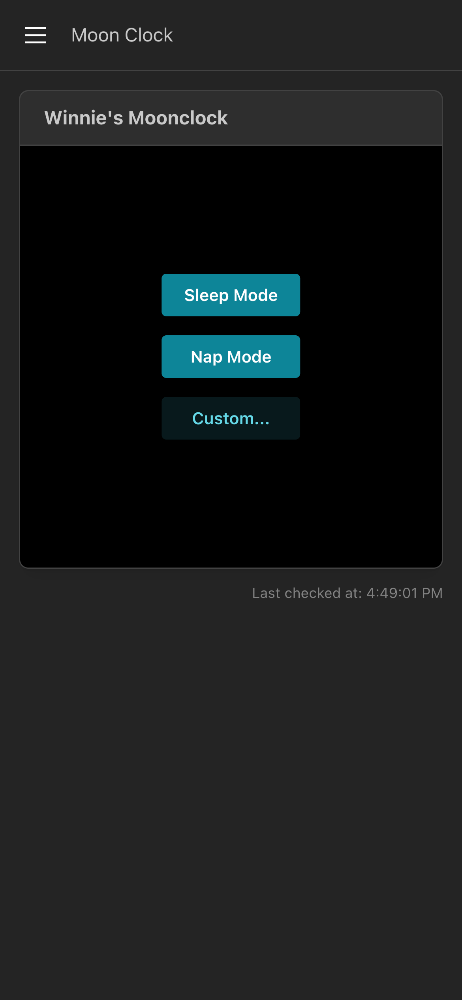
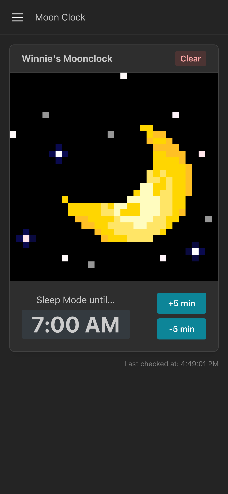
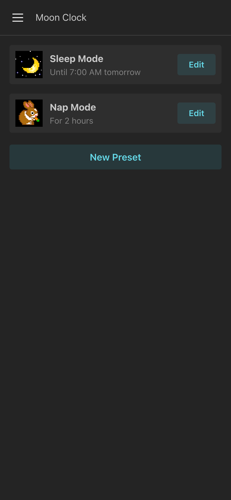
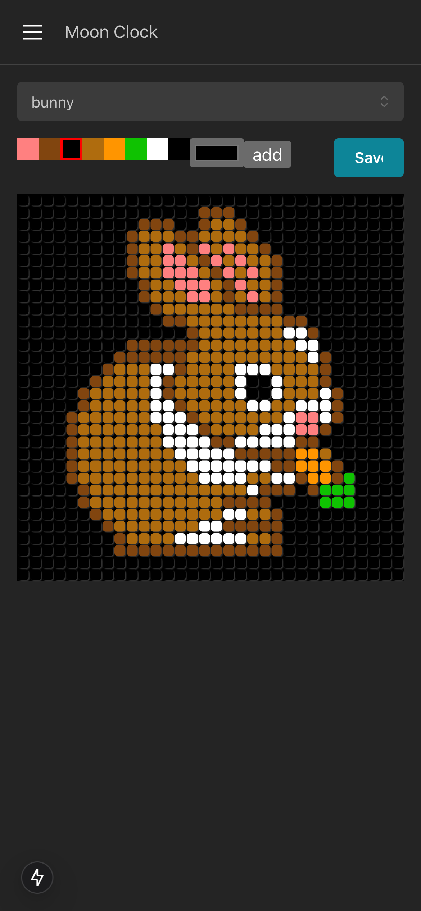
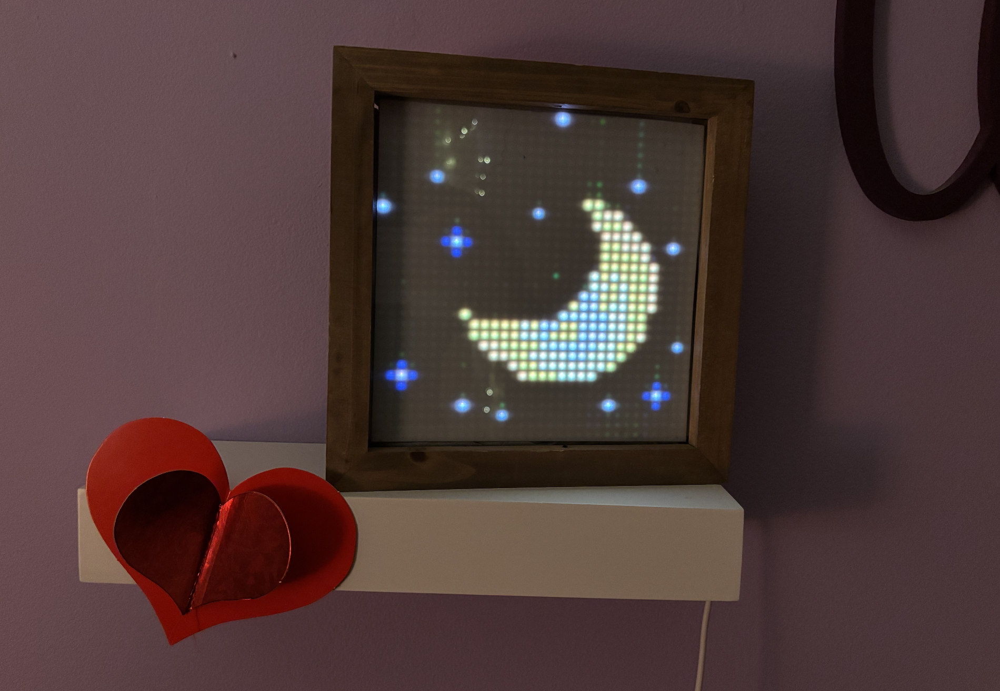
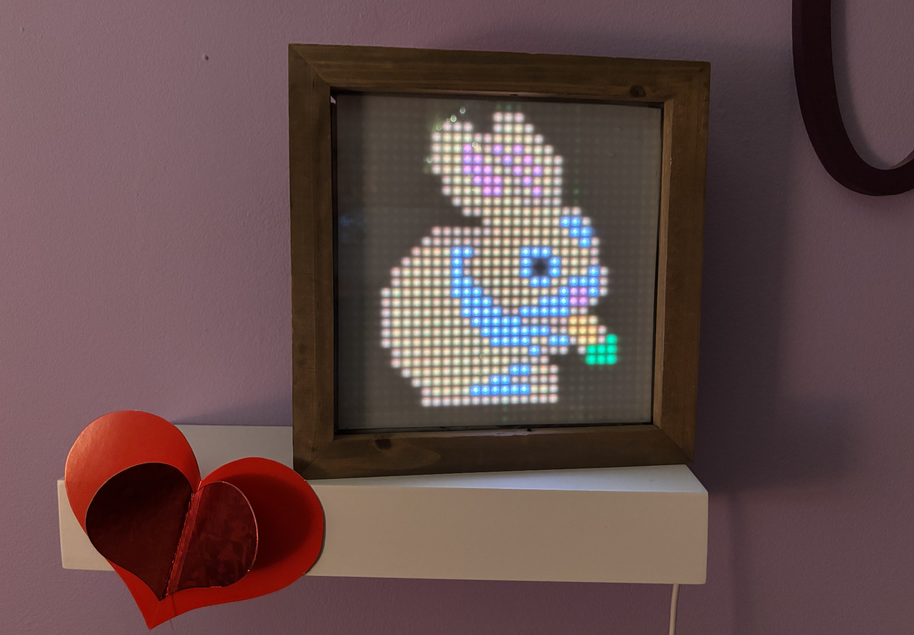
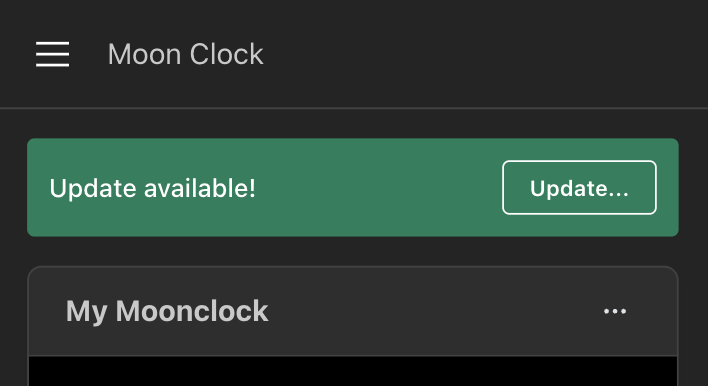

# Moonclock

## What is this?

It's a LED display powered by a RaspberryPi and you control it via this webapp, hosted on the Pi, or via an external button connected via GPIO pins.

You can configure an LED scene to display..

- For a period a time
- Until a specific time, tomorrow

I created this to help teach my toddler when bedtime and naptime are over, however the use-cases extend much farther!

```
"Daddy, my moonclock is off!"
My daughter, every morning at 7am! 😮‍💨
```

## The webapp and Panel

<p float="left">
    
    
    
    
</p>

👉 Unfortunately **a photo doesn't capture the colors** well in the panel, but here is a real moonclock in action!

<p float="left">
    
    
</p>

## Technology

The webapp is a Nextjs app that uses React Server Components and Server Actions. It runs off of a local json file that serves as the database.

The panel communication happens via the incredible [hzeller/rpi-rgb-led-matrix](https://github.com/hzeller/rpi-rgb-led-matrix) library and uses [alexeden/rpi-led-matrix](https://github.com/alexeden/rpi-led-matrix) which provides typescript bindings to hzeller's project.

The panel rendering is powered by [node-canvas](node-canvas). This allows for text, shapes, and more to easily be rendered on the panel. Additionally panel scenes can be rendered on the server or in the browser.

There are three processes (via systemd) that are run together:

- Nextjs webapp
- Hardware client
- Update checker

## Building a Moonclock

You'll need the following supplies:

1. A 32x32 LED panel, like this [one](https://www.adafruit.com/product/607)
1. A raspberry PI 3 or 4
1. [Female jumper wires](https://www.adafruit.com/product/266)
1. A usb cable that you can cut to power the LED panel
1. A usb cable to power the raspberry pi
1. Optional - For Button: [16mm push button](https://www.adafruit.com/product/1504)
1. Optional - For Button: [Button quick connect wire pairs](https://www.adafruit.com/product/1152)
1. Optional - For Presentation: [Translucent plastic](https://www.amazon.com/dp/B09XR1XBWG?ref=ppx_yo2ov_dt_b_fed_asin_title&th=1) to soften the LED Panel
1. Optional - For Presentation: 8.5" x 8.5" frame to house the Panel

Wire the panel according to the wiring chart [here](https://github.com/hzeller/rpi-rgb-led-matrix/blob/master/wiring.md).

👉 Remember, you are wiring a 32x32 panel, double check your work!

## Installation

Install the latest raspbian (not desktop verion!) on your pi. Joining it to WiFi up front is optional — you can also let Moonclock walk you through it after it's running (see [WiFi setup](#wifi-setup)). Then ssh into the machine and run...

```
curl -fsSL https://raw.githubusercontent.com/roykolak/moonclock/main/bootstrap.sh | sudo bash
```

That's the whole thing. It prepares the machine, downloads the latest release, installs it, and reboots.

Specifically, it...

- Disables onboard sound, which `hzeller/rpi-rgb-led-matrix` [requires](https://github.com/hzeller/rpi-rgb-led-matrix?tab=readme-ov-file#bad-interaction-with-sound)
- Configures GPIO 25 and its udev rule, for the optional external button
- Installs `wifi-connect` and NetworkManager for the WiFi setup portal
- Sets the hostname to `moonclock` so the app lives at `http://moonclock.local`
- Downloads and installs the latest release
- Reboots to apply the boot config

It's safe to re-run — every step checks before it changes anything.

It installs the latest stable release. To run beta builds, switch the "Release channel" setting to Beta once you're up.

Pass `--no-reboot` if you'd rather reboot yourself:

```
curl -fsSL https://raw.githubusercontent.com/roykolak/moonclock/main/bootstrap.sh | sudo bash -s -- --no-reboot
```

You can configure the LED panel up front instead of editing it on the Settings
page after first boot. Any of these flags are forwarded to the installer, and
only the fields you pass are changed:

```
curl -fsSL https://raw.githubusercontent.com/roykolak/moonclock/main/bootstrap.sh | sudo bash -s -- \
  --brightness=50 --hardware-mapping=adafruit-hat-pwm --pwm-bits=11 \
  --gpio-slowdown=4 --pwm-lsb-nanoseconds=130 --pwm-dither-bits=0 \
  --limit-refresh-hz=0
```

- `--brightness=N` — panel brightness, 0-100
- `--hardware-mapping=NAME` — `regular`, `adafruit-hat`, `adafruit-hat-pwm`, or `regular-pi1`
- `--pwm-bits=N` — PWM bits, 1-11
- `--gpio-slowdown=N` — GPIO slowdown, 0-4
- `--pwm-lsb-nanoseconds=N` — PWM LSB nanoseconds
- `--pwm-dither-bits=N` — time-dither the lowest bits, 0-2
- `--limit-refresh-hz=N` — cap the refresh rate in Hz, 0 for no limit
- `--panel-type=NAME` — empty for a standard HUB75 panel, or `FM6126A` / `FM6127`

Re-running with these flags overwrites those fields even if you've since tuned
them on the Settings page. The flags require a release that includes them, so
they're a no-op against older releases.

### Ghosting and smearing

If lit pixels leave a faint copy elsewhere in their column, or smear sideways,
the fix is in the panel timing rather than the scene. The number that matters is
the shortest time a row is lit for:

```
min OE pulse = pwm-lsb-nanoseconds × 2 ^ (11 − pwm-bits)
```

The library stores color as 11 bitplanes and lights plane `b` for
`pwm-lsb-nanoseconds × 2^b`, skipping the lowest `11 − pwm-bits` of them. At the
defaults (`--pwm-bits=11 --pwm-lsb-nanoseconds=130`) that shortest pulse is
130ns. Column data is clocked in while the previous plane is still lit, so once
the pulse gets close to the time it takes to shift 32 columns in, the panel
spends much of its lit time showing half-shifted data — which is the smear.

Raising `--pwm-lsb-nanoseconds` lengthens every plane proportionally and costs
refresh rate. Lowering `--pwm-bits` costs color depth but almost no refresh rate
(11 → 8 drops only 0.34% of the frame while making the shortest pulse 8×
longer), so it's usually the cheaper lever. A high `--gpio-slowdown` widens the
smear window directly, so try lowering it before anything else — back off again
if pixels start coming out corrupted.

`hardware/test-matrix.ts` ships as `dist/hardware/test-matrix.cjs` and draws the
worst-case patterns for this while printing the resulting pulse width and
refresh rate, so you can compare settings without reinstalling:

```
cd /usr/local/bin/moonclock/current/dist/hardware
sudo node test-matrix.cjs --pwm-bits=9 --pwm-lsb-nanoseconds=300 --slowdown=2
```

One caveat worth knowing: the `adafruit-hat` mapping puts Output Enable on GPIO
4, which the library cannot pulse with the hardware PWM peripheral — it falls
back to a busy-wait timer whose jitter causes ghosting on its own. Bridging GPIO
4 and GPIO 18 on the HAT and switching to `adafruit-hat-pwm` is the single
largest improvement available, and no timing value fully substitutes for it.

Your moonclock will automatically start after any pi restarts.

To start Moonclock immediate run...

```
sudo mc start
```

## Reaching the app

```
http://moonclock.local
```

That address is fixed — it doesn't change when your router hands the pi a
different IP, so it's worth a sticker on the frame. It works over mDNS
(Bonjour), which is built into macOS, iOS, Windows 10+, and Android 12+.

The pi is renamed to `moonclock` on install, and `avahi` publishes
`<hostname>.local` from there. If you'd already given yours a different
hostname, install.sh leaves it alone and your address is `http://<that name>.local`
instead. Two clocks on one network get `moonclock.local` and `moonclock-2.local`,
since mDNS names have to be unique on a link.

If `.local` doesn't resolve — some guest and corporate networks block mDNS — the
IP still works. Find it from your router's client list, or over ssh:

```
hostname -I
```

The panel deliberately doesn't display the address. Reading a 12-digit IP off a
32x32 grid means scrolling it, and a scrolling address is one you have to sit and
watch, catch every octet of, and re-read whenever DHCP changes it. A fixed name
you already know beats that, so boot just reports state instead:

- **Rainbow ring** — starting up, waiting for the network
- **Green check** — connected, app is up
- **Amber WiFi glyph** — needs WiFi setup, see below
- **Red "No network"** — gave up waiting; no setup portal and no address

## WiFi setup

If the pi boots without a network connection, Moonclock guides you through joining
one — no keyboard, screen, or ssh required:

1. The LED panel shows a pulsing amber **WiFi "searching" animation** — its
   signal for "I need to be set up."
2. On your phone, open WiFi settings and join the open **Moonclock** network. A
   setup page pops up automatically.
3. Pick your home WiFi, enter its password, and submit.
4. The pi connects, the setup hotspot disappears, and the panel shows a green
   check. The setup page hands you the address on its way out:
   `http://moonclock.local`.

Under the hood this is [balena wifi-connect](https://github.com/balena-os/wifi-connect)
running a captive portal — with our own Moonclock-branded setup page
(`wifi-connect-ui/`, shipped in the release) in place of its stock UI —
coordinated with the panel by the `moonclock-wifi-provision` service. Once the pi
is connected, the web app starts as usual.

**Changing networks later** (e.g. you moved): press and hold the external button
for ~5 seconds. The panel shows a "Reset WiFi?" countdown; keep holding and the
pi forgets its saved networks and reboots back into the setup flow above.

## Updating

Your moonclock will check if there is a new version available nightly.

When a new version is available, you will see a banner like the one below in your moonclock app. Just click the update buttons and you'll be all set in a few seconds!



### Release channels

By default your moonclock only receives stable releases. If you want to try prerelease builds, switch the "Release channel" setting to Beta on the Settings page.

Switching back to Stable never downgrades — the moonclock keeps its current beta build until a newer stable release ships, then updates to that.

## Data Storage

All data is stored in `/var/lib/moonclock`. This includes...

- `database.json`
- `custom_scenes/`

This means that updating moonclock to the latest release will not effect the current of moonclock's data and configuration.

## Debugging

You can view logs with the following commands:

```
mc logs
```

Also you can trigger a restart of the hardware process with:

```
mc restart
```

## Developing locally

Clone and install Moonclock...

```
cd /usr/local/bin/
sudo git clone https://github.com/roykolak/moonclock.git
cd moonclock
sudo npm install
```

```
sudo npm run start:dev
```

## Build a release

```
npm run build
```

## Publishing a release

`npm run release <channel>` bumps the version, builds the tarball, pushes the commit and tag, and creates the GitHub release with auto-generated notes. A channel (`prod` or `beta`) is required — running it without one prints usage and publishes nothing.

```
npm run release prod          # stable, patch bump
npm run release prod minor
npm run release prod major
npm run release prod 0.87.5   # specific version
```

Requires a clean working tree on `main` and an authenticated `gh` CLI (`gh auth status`). If the build or push fails, the local commit and tag are rolled back automatically. If the GitHub release step fails after the push, the script prints the commands needed to clean up the remote tag.

### Beta releases

`npm run release beta` publishes a GitHub prerelease that only moonclocks on the Beta release channel will pick up.

```
npm run release beta          # 0.91.0 -> 0.92.0-beta.0, then -beta.1, -beta.2, ...
npm run release beta major    # 0.91.0 -> 1.0.0-beta.0
npm run release beta patch    # 0.91.0 -> 0.91.1-beta.0
```

Starting from a stable version begins a new beta line (minor bump by default); running it again on a beta version increments `-beta.N`.

To promote a beta line to stable, run `npm run release prod` — on `0.92.0-beta.3` it publishes `0.92.0`. The script prints a promotion notice when this happens.

## Developing on a pi

```
scp release.tar.gz pi@192.168.4.225:~/
```

## Developing on a vm

This is useful to test updates to the service files, install scripts, and the update process.

Would recommend using [multipass](https://canonical.com/multipass) as it is the quickiest way to start up a vm via the commandline.

```
npm run build
multipass launch --name moonclock-vm
multipass start moonclock-vm
multipass transfer release.tar.gz moonclock-vm:
multipass shell moonclock-vm
tar -xzvf release.tar.gz
cd ./moonclock
mv dist/hardware/vm-canvas.node dist/hardware/canvas.node
sudo ./install.sh

multipass info moonclock-vm
```
